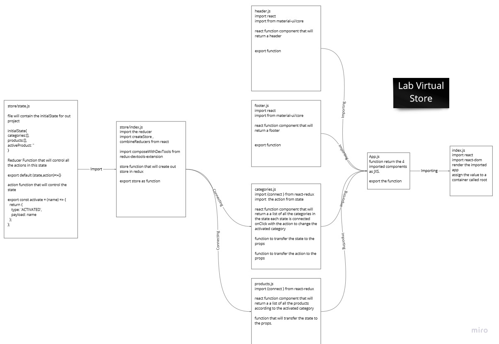

# Virtual Store

StoreFront application written in react, we will go throw 4 Phases to finish the application.

[MATERIAL-UI](https://material-ui.com/) was used for designing.

## start the server

1. Clone the Repo from the link

2. use `npm i` to install all the dependencies that we used

3. use `npm start` to start the application

## Deploy Link

[https://storefront-saif.netlify.app/](https://storefront-saif.netlify.app/)

## Phase 1

### Requirements

- As a user, I expect to see a list of available product categories in the store so that I can easily browse products

- As a user, I want to choose a category and see a list of all available products matching that category

- As a user, I want a clean, easy to use user interface so that I can shop the online store with confidence

### UML

## Phase 2

### Requirements

- As a user,you can choose from products in the list and add them to your shopping cart

- As a user, you can see the products that you have added to your shopping cart so that

- As a user, you can change the quantity of items you intend to purchase in your shopping cart

- As a user, you will be able to remove an item from my shopping cart

### UML

